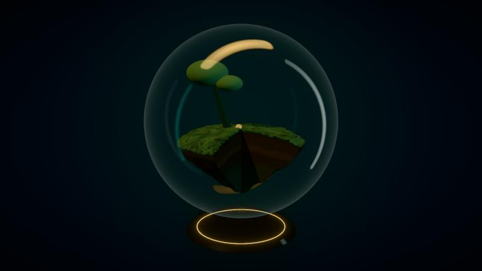
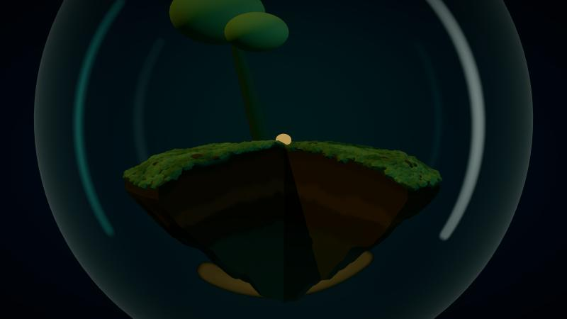

# MICROVERSE — The Last Seed

> *An entire world, waiting for your touch.*

Experimento 3D interactivo: un ecosistema diminuto dentro de una esfera de cristal suspendida en la oscuridad, que el visitante despierta, cuida y transforma. Bajo la tierra, una red de raíces luminosas conecta a todos los organismos.

El mundo **tiene memoria**: acumula luz y humedad, y ese estado decide cuánto crece la vegetación, cuánto brillan las raíces y cuándo aparecen las luciérnagas.

**Estado:** Jornada 2 completada: isla flotante procedural con corte de diorama y estratos, musgo y piedras con instancing, sombras y luz de mañana. Siguiente: jornada 3, árbol y raíces procedurales.

| Vista | Corte de diorama |
|---|---|
|  |  |

Historial visual en [docs/capturas](docs/capturas).

## Desarrollo

Requiere Node 24 (`.nvmrc`).

```bash
npm install
npm run dev        # servidor de desarrollo (FPS, draw calls y panel Leva de look-dev)
npm run dev:poll   # igual, con polling: si los cambios no se recargan (Windows)
npm run test       # tests en modo watch
npm run lint
npm run build      # typecheck + build de producción
```

## Documentación

| Documento | Contenido |
|---|---|
| [01 · Visión](docs/01-vision.md) | Concepto, pilares, recorrido del visitante, alcance |
| [02 · Dirección de arte](docs/02-direccion-de-arte.md) | Paleta y sus roles, composición, iluminación, árbol, subsuelo, post-proceso |
| [03 · Stack y versiones](docs/03-stack.md) | Tecnologías, versiones exactas verificadas, lo que no usamos |
| [04 · Arquitectura](docs/04-arquitectura.md) | Carpetas, flujo de datos, patrones R3F, calidad adaptativa |
| [05 · EcosystemEngine](docs/05-ecosystem-engine.md) | Especificación del motor de vida: estado, reglas, salidas |
| [06 · Roadmap](docs/06-roadmap.md) | Plan por jornadas, hitos, definición de terminado, riesgos |
| [Decisiones (ADR)](docs/decisiones.md) | Registro de decisiones del proyecto |

## Stack (resumen)

React 19.3 · TypeScript 6.0 · Vite 8 · Three.js r186 · React Three Fiber 9.8 · Drei 10.7 · postprocessing 6.39 · Zustand 5 · GLSL · Vitest 5.
Detalle y justificación en [docs/03-stack.md](docs/03-stack.md).
